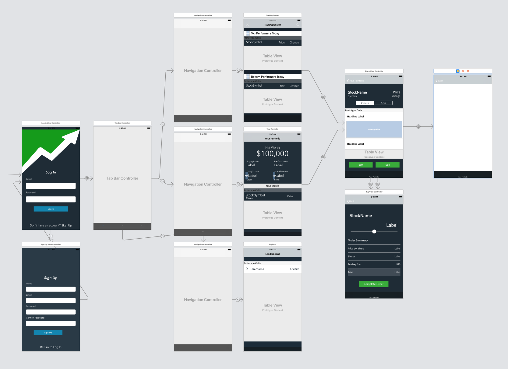
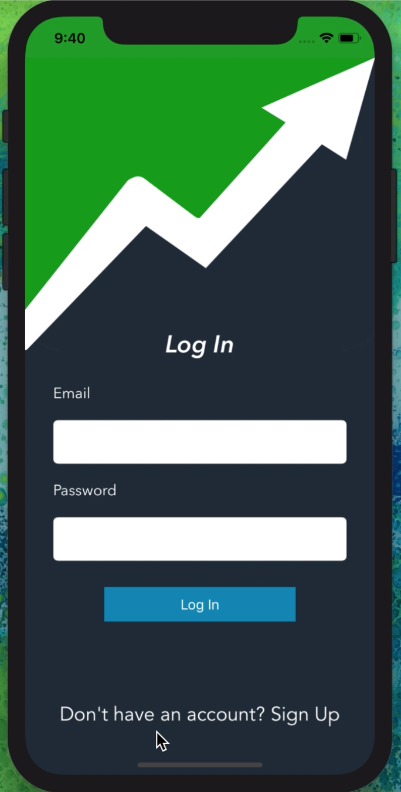
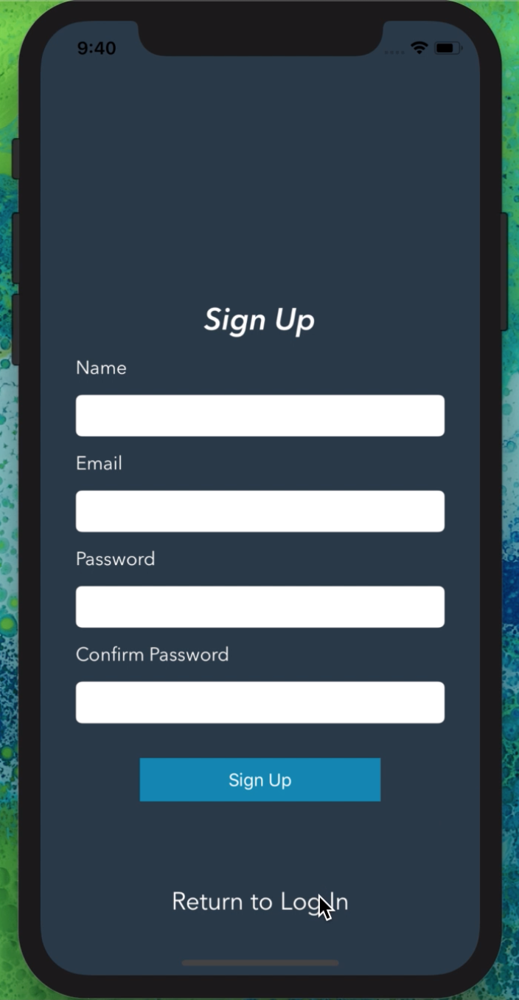
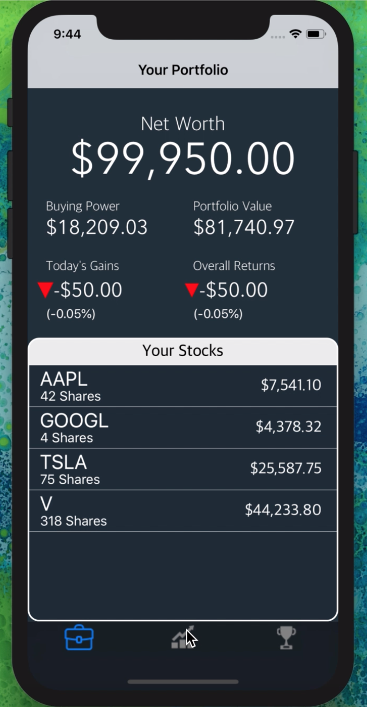
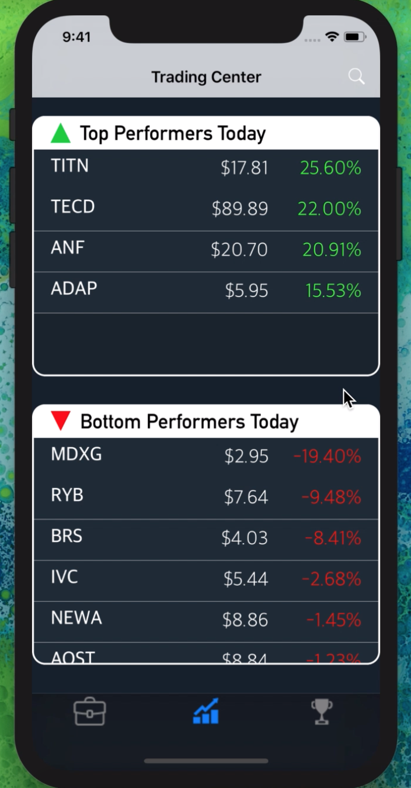
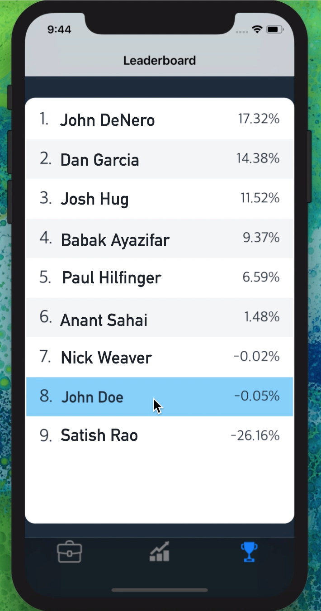
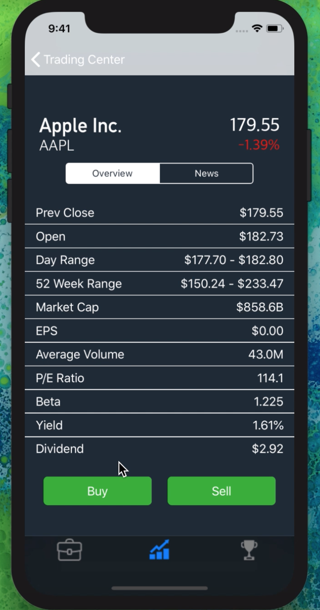
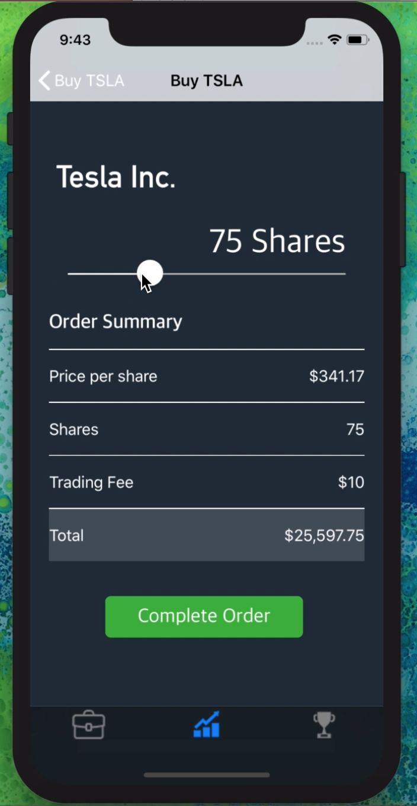

# StockGame
An iOS Stock Exchange App with real-time market data where users can trade stocks with virtual money and compete with each other.

 
 
&nbsp;

### Technologies/Libraries:
  * Written in Swift 4 using XCode 10
  * [Firebase](https://firebase.google.com) for user authentication and user data storage.
  * [IEX Trading API](https://iextrading.com/developer/docs/) for real-time market data.
  * [Google News API](https://newsapi.org/s/google-news-api) for company and market related news.
  * [Alamofire](https://github.com/Alamofire/Alamofire) for HTTP networking.
  
&nbsp;

### Login / Signup

 
 
 

## Portfolio / Discover / Leaderboard

 
 
 

## Stock View / News

 
 
 

## Buy / Sell

 
 

